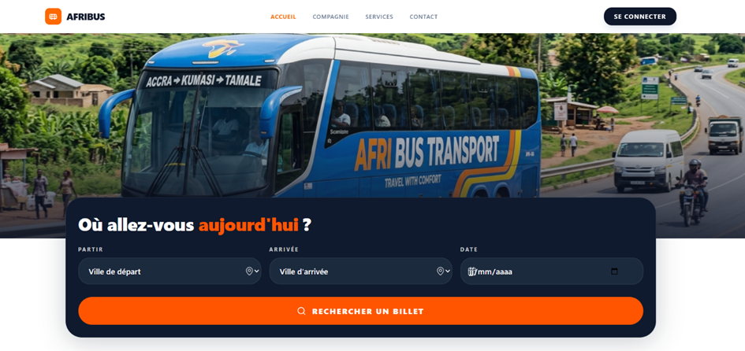
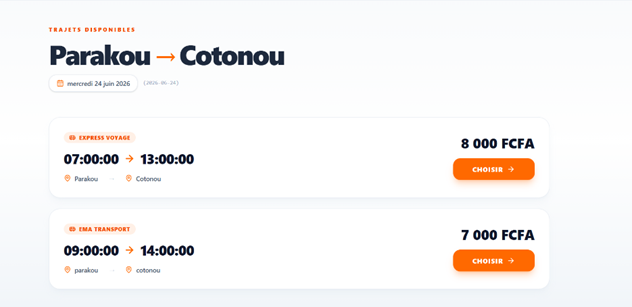
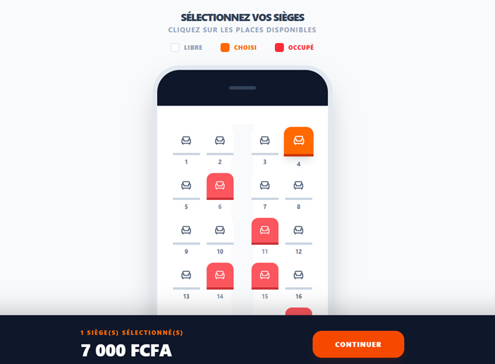
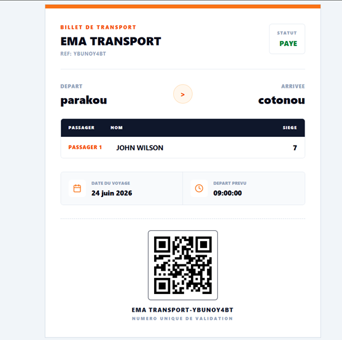
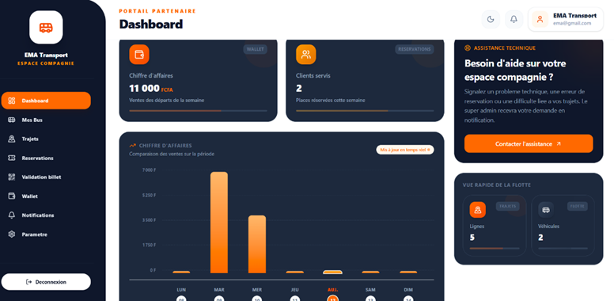
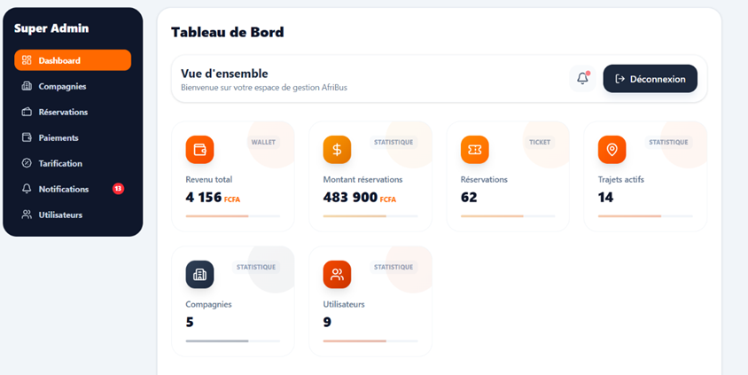

# 🚌 AFRIBUS

**Plateforme SaaS multi-compagnie de gestion et de réservation de billets de bus pour l'Afrique de l'Ouest**

AFRIBUS connecte plusieurs compagnies de transport (Bénin, Togo, Niger, Ghana, Côte d'Ivoire) sur une plateforme unique, permettant aux voyageurs de rechercher, réserver et payer leurs billets en ligne, et aux compagnies de gérer leurs trajets, véhicules et réservations depuis un tableau de bord dédié.

> *"AFRIBUS — parce que chaque voyage mérite d'être simple."*

---

## ✨ Fonctionnalités

- **Réservation en ligne** : recherche de trajets par ville et date, résultats en temps réel avec prix et horaires
- **Sélection de sièges interactive** : plan du bus visuel (libre / choisi / occupé)
- **Paiement Mobile Money** intégré via FedaPay et CinetPay
- **Billet numérique sécurisé** : QR code signé HMAC-SHA256, infalsifiable, avec référence unique de validation
- **Espace Compagnie (partenaire)** : gestion des bus, trajets, réservations, validation des billets, portefeuille (wallet) et statistiques de chiffre d'affaires
- **Espace Super Admin** : supervision multi-compagnies, gestion des paiements, de la tarification, des utilisateurs et des notifications
- **Multi-entreprise (SaaS)** : chaque compagnie de transport gère ses propres trajets, véhicules et tarifs de façon indépendante

## 🛠️ Stack technique

| Couche | Technologie |
|---|---|
| Backend | Laravel (PHP) |
| Frontend | React |
| Base de données | MySQL |
| Paiements | FedaPay, CinetPay |
| Sécurité | QR codes signés HMAC-SHA256 |
| Architecture | Modélisée en UML (5 acteurs, 12 classes, 4 énumérations) |

## 🏗️ Architecture

Le projet suit une architecture client-serveur classique :
- Une **API Laravel** expose les ressources (trajets, réservations, utilisateurs, compagnies, paiements)
- Un **frontend React** consomme cette API et gère l'expérience utilisateur (recherche, réservation, tableau de bord)
- La modélisation UML complète (cas d'utilisation et diagramme de classes) a guidé la conception avant le développement

## 📸 Aperçu

| Recherche de trajet | Résultats disponibles |
|---|---|
|  |  |

| Sélection des sièges | Billet avec QR code sécurisé |
|---|---|
|  |  |

| Espace compagnie (partenaire) | Espace Super Admin |
|---|---|
|  |  |

## 🚀 Installation

```bash
# Cloner le dépôt
git clone https://github.com/AlexAhdn/Affribus_app.git
cd Afribus_app

# Backend (Laravel)
cd backend
composer install
cp .env.example .env
php artisan key:generate
php artisan migrate
php artisan serve

# Frontend (React)
cd ../frontend
npm install
npm run dev
```

## 👤 Auteur

**Alex Emmanuel AHOUANDJINOU**
Développeur Full Stack — Étudiant en Licence Professionnelle, Architecture Logicielle (ESGIS Bénin)
📧 axeahdn@gmail.com

